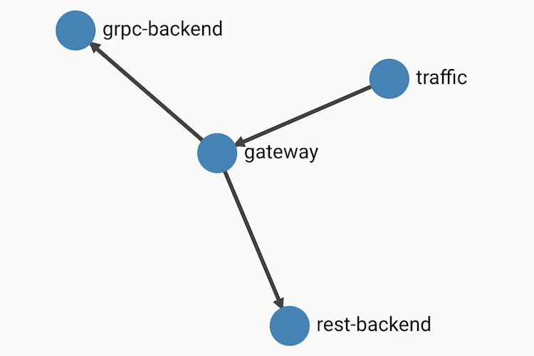

# gRPC + Linkerd Demo

Hello friends. In this repo you'll find a sample [gRPC](https://grpc.io)
application that can be run with [Linkerd](https://linkerd.io) on
[Kubernetes](https://kubernetes.io). The goal is to demonstrate the operability
features that you gain by running these three technologies together.

The demo is entirely open source, and it leverages some pretty cool projects:

* [Kubernetes](https://github.com/kubernetes), runs our application
* [gRPC](https://github.com/grpc), service-to-service communication
* [Linkerd](https://github.com/linkerd/linkerd2), metrics and reliability
* [Prometheus](https://github.com/prometheus/prometheus), by way of Linkerd
* [Grafana](https://github.com/grafana/grafana), by way of Linkerd
* [Building Blocks](https://github.com/buoyantio/bb), for building a sample app
* [Slow Cooker](https://github.com/buoyantio/slow_cooker), for sending traffic

Check them out when you have the chance.

## Pre-requisites

Before we get started, you'll need to install a few tools, as follows:

1. Setup a working Kubernetes cluster and configure the `kubectl` CLI.
   (see https://kubernetes.io/docs/setup/ for more info)

2. Install the `linkerd` CLI: `curl https://run.linkerd.io/install-edge | sh`
   (see https://linkerd.io/2/getting-started/ for more info)

## Install Linkerd

Let's start by installing the Linkerd control plane into our cluster:

```
linkerd install | kubectl apply -f -
```

Verify that the control plane is properly installed by running:

```
linkerd check
```

## Install the sample app

Now let's install the sample application defined in `app.yml` into the `default`
namespace of our Kubernetes cluster:

```
kubectl apply -f app.yml
```

This will create a `traffic` deployment, a `gateway` deployment, and two backend
deployments. The `rest-backend` deployment serves requests over HTTP/1.1, and
the `grpc-backend` deployment serves requests over gRPC (HTTP/2). The topology
of the application looks like this:



## Investigate load balancing

The backend deployments have already been injected with the Linkerd proxy
sidecar, since the pods for those deployments have the `linkerd.io/inject`
annotation set. This means that we can already see some stats by running:

```
linkerd stat deploy
```

That will display:

```
NAME           MESHED   SUCCESS       RPS   LATENCY_P50   LATENCY_P95   LATENCY_P99   TCP_CONN
gateway           0/1         -         -             -             -             -          -
grpc-backend      3/3   100.00%   60.0rps           2ms           9ms          16ms          2
rest-backend      3/3   100.00%   60.4rps           1ms           5ms           9ms         27
traffic           0/1         -         -             -             -             -          -
```

We can also see a breakdown of traffic by pod:

```
linkerd stat pod
```

That will display:

```
NAME                            MESHED   SUCCESS       RPS   LATENCY_P50   LATENCY_P95   LATENCY_P99   TCP_CONN
gateway-6d7f4b6d85-rm82b           0/1         -         -             -             -             -          -
grpc-backend-786b7d4566-d5lvd      1/1         -         -             -             -             -          -
grpc-backend-786b7d4566-sz6k2      1/1         -         -             -             -             -          -
grpc-backend-786b7d4566-vgmf7      1/1   100.00%   60.0rps           2ms           8ms          10ms          2
rest-backend-78dd77d9c7-5r7qj      1/1   100.00%   17.4rps           1ms           7ms          10ms          8
rest-backend-78dd77d9c7-f2q5d      1/1   100.00%   21.0rps           1ms           7ms          10ms          8
rest-backend-78dd77d9c7-zj9zm      1/1   100.00%   21.9rps           1ms           8ms          13ms          8
traffic-747c965578-ssbzp           0/1         -         -             -             -             -          -
```

Notice how all gRPC traffic is going to only one of the three pods in the
`grpc-backend` deployment. Let's fix that by adding Linkerd!

```
kubectl get deploy -oyaml | linkerd inject - | kubectl apply -f -
```

That will add the Linked proxy sidecar to the remaining deployments in the
`default` namespace.

Once the new pods are started, re-running `linkerd stat pod` will display:

```
NAME                            MESHED   SUCCESS       RPS   LATENCY_P50   LATENCY_P95   LATENCY_P99   TCP_CONN
gateway-7f9fc5676d-t9mht           1/1   100.00%   60.0rps          31ms          40ms          47ms         30
grpc-backend-786b7d4566-d5lvd      1/1   100.00%   19.4rps           1ms           7ms           9ms          2
grpc-backend-786b7d4566-sz6k2      1/1   100.00%   20.7rps           1ms           6ms           9ms          2
grpc-backend-786b7d4566-vgmf7      1/1   100.00%   19.8rps           1ms           5ms           9ms          3
rest-backend-78dd77d9c7-5r7qj      1/1   100.00%   21.5rps           1ms           4ms           8ms         15
rest-backend-78dd77d9c7-f2q5d      1/1   100.00%   19.8rps           1ms           4ms           9ms         15
rest-backend-78dd77d9c7-zj9zm      1/1   100.00%   17.5rps           1ms           4ms          10ms         13
traffic-747c965578-ssbzp           0/1         -         -             -             -             -          -
```

Huge improvement!

## Explore Linkerd

At this point we can explore more features of Linkerd. For instance, we can view
individual requests to the `grpc-backend` pods by running:

```
linkerd tap deploy/grpc-backend
```

Or we can view the Linkerd and Grafana dashboards by running:

```
linkerd dashboard
```

## Add service profiles

Let's use [service profiles](https://linkerd.io/2/features/service-profiles/) to
enable per-endpoint metrics and configure client timeouts for the backends.

A service profile for the `grpc-backend` service can be created directly from
the protobuf definition for our gRPC API:

```
linkerd profile --proto grpc-backend.proto grpc-backend | kubectl apply -f -
```

Likewise a service profile for the `rest-backend` service can be created
directly from the swagger definition for our REST API:

```
linkerd profile --open-api rest-backend.swagger rest-backend | kubectl apply -f -
```

With those profile in place, we can use the `routes` command to see data about
how our routes are performing:

```
linkerd routes svc/grpc-backend
```

That will display:

```
ROUTE              SERVICE   SUCCESS       RPS   LATENCY_P50   LATENCY_P95   LATENCY_P99
[DEFAULT]     grpc-backend     0.00%    0.0rps           0ms           0ms           0ms
theFunction   grpc-backend   100.00%   60.0rps           1ms           7ms           9ms
```

And:

```
linkerd routes svc/rest-backend
```

Will return:

```
ROUTE            SERVICE   SUCCESS       RPS   LATENCY_P50   LATENCY_P95   LATENCY_P99
GET /       rest-backend     0.00%    0.0rps           0ms           0ms           0ms
[DEFAULT]   rest-backend   100.00%   59.4rps           1ms           6ms           9ms
```

Service profiles can also be used to provide per-route configuration. For
instance, let's set a timeout on requests to the our backends to improve the
overall latency of our gateway service. Run:

```
kubectl edit sp/grpc-backend.default.svc.cluster.local
```

And add a `timeout` field as follows:

```
spec:
  routes:
  - condition:
      method: POST
      pathRegex: /buoyantio\.bb\.TheService/theFunction
    name: theFunction
    timeout: 20ms
```

Likewise run:

```
kubectl edit sp/rest-backend.default.svc.cluster.local
```

And add a `timeout` field as follows:

```
spec:
  routes:
  - condition:
      method: GET
      pathRegex: /
    name: GET /
    timeout: 20ms
```

That will timeout all backend requests taking longer than 20 milliseconds. And
sure enough, if we look at stats for requests to the `gateway` deployment, we
can see that its latency and success rate have fallen:

```
linkerd stat deploy/gateway
```

That will display:

```
NAME      MESHED   SUCCESS       RPS   LATENCY_P50   LATENCY_P95   LATENCY_P99   TCP_CONN
gateway      1/1    95.53%   60.0rps          26ms          39ms          46ms         16
```

In this case we've exchanged latency for success rate, but in a production
scenario we could also add retries to improve success rate.

## Learn more

For more information about Linkerd and gRPC, check out the following blog posts:

- https://kubernetes.io/blog/2018/11/07/grpc-load-balancing-on-kubernetes-without-tears/
- https://kubernetes.io/blog/2018/09/18/hands-on-with-linkerd-2.0/
